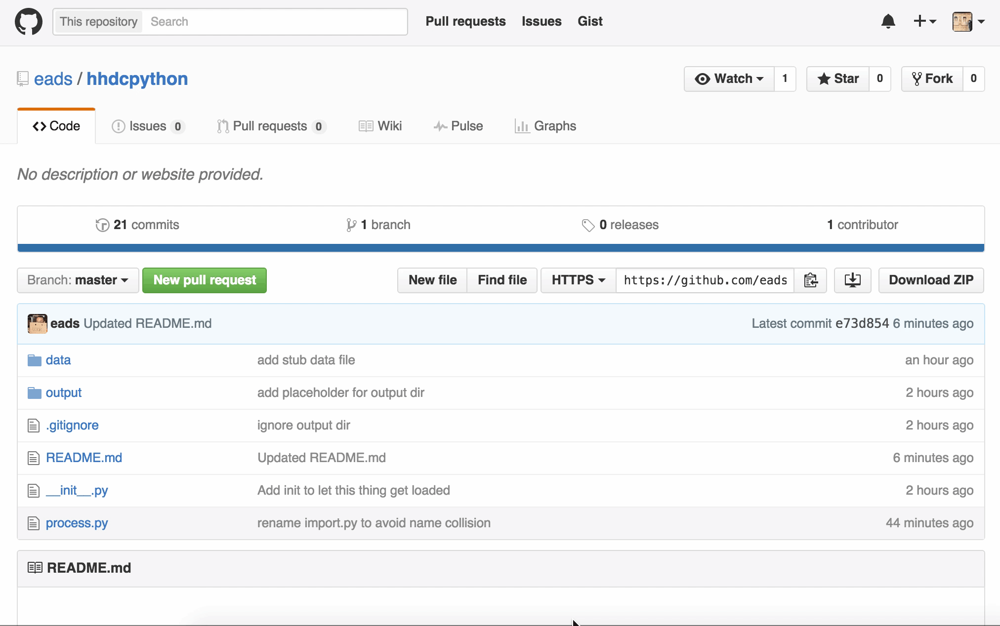
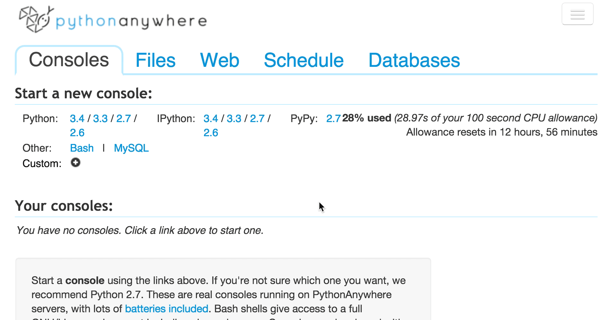
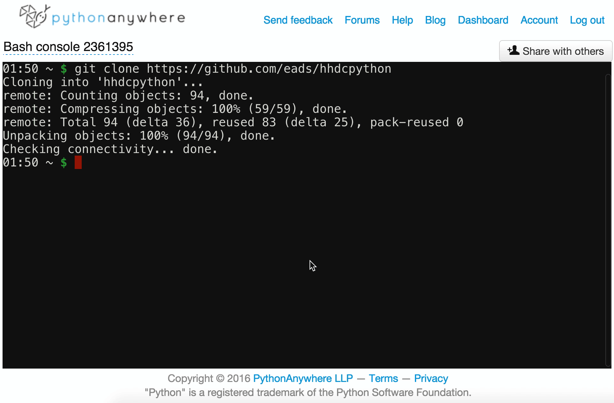

# Hacks/Hackers DC Python class instructions

It's your first week as a newsroom coder. A city reporter needs you to clean and summarize some data. She doesn't need anything fancy, but she does need it in a few hours.

Fortunately, one of your colleagues set up a repository with the dataset and an unfinished Python script with some notes. Unfortunately, the data is a real mess. Oh, and did I mention the data is in Spanish?

Now it's up to you to finish the job.

You'll make a copy your colleague's work by using Git's fork feature, install your copy on PythonAnywhere, then modify it to process the data.

By the end, you'll produce a clean CSV version of the data you can share with the reporter so she can analyze it in Excel. You'll also produce some basic analysis of the cleaned data to help her get started.

## Prerequisities

You'll need to sign up with a couple of services to complete this job:

* [Github](https://github.com)
* [PythonAnywhere](https://www.pythonanywhere.com) (create a beginner account)

## Getting set up for the first time

At least your charmingly cryptic co-worker David left you a place to start: A git repository with some data and the bones of a script to process it. So that's where you'll start.

"Wait, isn't that cheating?" you may be asking. Sure, it's cheating -- but only insofar as "programming languages" are "cheating". Creating abstraction to make doing work easier is a foundational principle of working with computers and lots of other technology aside. 

Cheat away! Lots of people think they need to know everything about a programming language to do anything, and it just doesn't work like that. You only need to know enough to solve your problem -- and if someone is already 70% of the way there and willing to share, take their help. 

And remember, they're only 70% of the way there because people have been developing languages like Python for a couple of decades. Python only happened because other people have been developing C, the language Python is based on, for about four decades. None of this would have been possible without the invention of little tiny processing chips six decades ago. One could go on like this forever.

In the course of solving your problem, you'll probably learn something new. Unless you're the long-prophesied immaculate coder, it usually works like that.

In the end, by giving you a template to start from, David was only following the practices established for any small data project at our company: start with a template that takes care of common problems in your daily work so you can focus on the problem at hand.

### Fork the code

Forking is a way of making your own version of someone else's code, usually because you want to improve it or modify it for your own purposes. At our company, you should always fork before you work on a project.

[Fork the repository for the class project](https://github.com/eads/hhdcpython#fork-destination-box) so you have your own copy of the code to hack on.



(You might think it's weird to digress into Git and version control so quickly. But this tutorial is meant to mimic a professional setting, and you're going to struggle a bit with version control in a professional setting.)

### Install the code on PythonAnywhere

Log in to [PythonAnywhere](https://www.pythonanywhere.com).

The first screen is the "Consoles" tab. Under the "Start a new console" section at the top of the page, click "Bash".

This creates a basic terminal session where you can run and manage code.

Once you see a prompt that looks like `03:11 ~ $`, you're ready to start typing in commands. Now it's time to get your copy of the code. Type the following into the terminal on your screen:

```
git clone https://github.com/<MYGITHUBUSERNAME>/hhdcpython
```

Note that you **must** replace `<MYGITHUBUSERNAME>` with your Github username.



## Editing and running the script

* If you are in a console, click the "PythonAnywhere" logo in the upper left to go back to the main screen.
* Click the "Files" tab.
* Click the `hhdcpython` directory on the left side of the screen.
* Click the `process.py` file on the right hand side of the screen.

A file editor will appear. You can now edit and run the script.



Try running it now. We'll walk through editing the script and processing the data when we meet.
